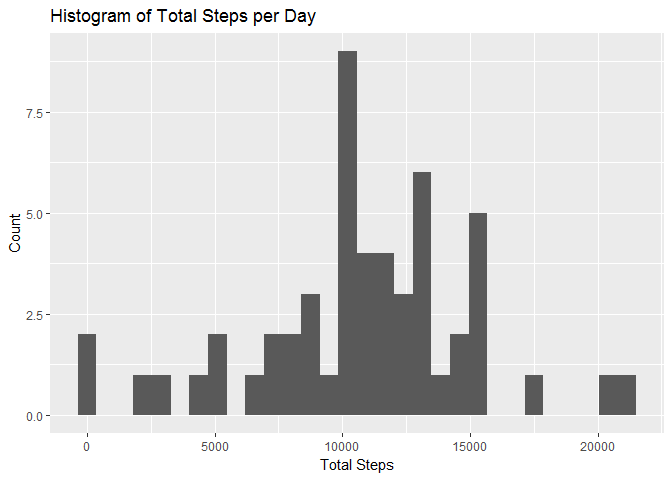
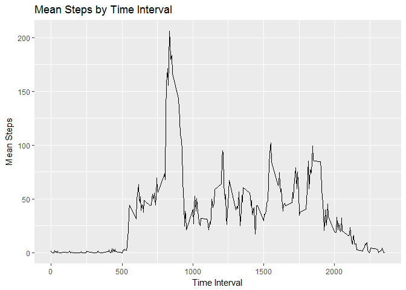
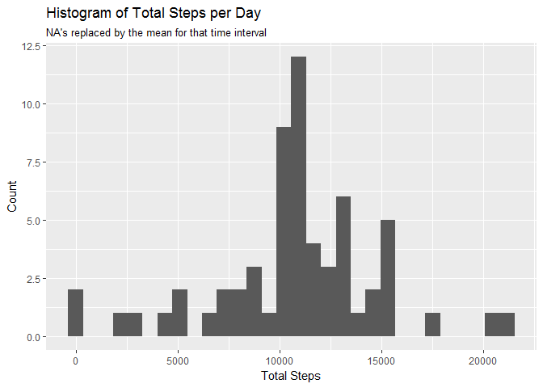
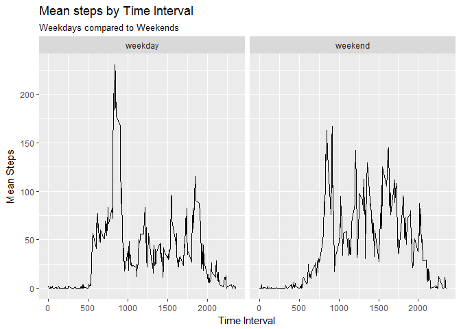

# Coursera Reproducible Research Assignment 1
Mike Anson  
July 13, 2017  

## Introduction

This assignment makes use of data from a personal activity monitoring device. This device collects data at 5 minute intervals through out the day. The data consists of two months of data from an anonymous individual collected during the months of October and November, 2012 and include the number of steps taken in 5 minute intervals each day.

The data for this assignment can be downloaded from the course web site:

Dataset: [Activity monitoring data](https://d396qusza40orc.cloudfront.net/repdata%2Fdata%2Factivity.zip) 

The variables included in this dataset are:

    steps: Number of steps taking in a 5-minute interval (missing values are coded as NA)
    date: The date on which the measurement was taken in YYYY-MM-DD format
    interval: Identifier for the 5-minute interval in which measurement was taken

The dataset is stored in a comma-separated-value (CSV) file and there are a total of 17,568 observations in this dataset.

# Read in the data

The data should be downloaded and storerd in your working directory.  Using the readr package, be sure to set the column type for dates in the correct format.


```r
library(readr)
activity <- read_csv("activity.csv", col_types = cols(date = col_date(format = "%Y-%m-%d")))        
```


Load the dplyr and ggplot2 packages to perform the analyses throughout the document.


```r
library(dplyr)
library(ggplot2)
```


## Make a histogram of the total number of steps taken each day


```r
activity %>%
        group_by(date) %>%
        summarise(total_steps = sum(steps)) %>%
        ggplot(aes(x = total_steps)) +
        geom_histogram() +
        labs(title = "Histogram of Total Steps per Day", x = "Total Steps", y = "Count")
```

<!-- -->


## Calculate and report the mean and median of the total number of steps taken per day


```r
summary_activity <- activity %>%
        group_by(date) %>%
        summarise(total_steps = sum(steps)) %>%
        summarise(mean_steps = mean(total_steps, na.rm =  TRUE), median_steps = median(total_steps, na.rm = TRUE))

summary_activity
```

```
## # A tibble: 1 x 2
##   mean_steps median_steps
##        <dbl>        <int>
## 1   10766.19        10765
```

A mean of 10,766.19 steps and a median of 10,765 steps per day.

# What is the average daily activity pattern?

## Make a time series plot (i.e. type = "l") of the 5-minute interval (x-axis) and the average number of steps taken, averaged across all days (y-axis)

As might be expected, activity is minimal during the hours one would be expected to be sleeping.  Activity increases in the morning, spiking around lunchtime (perhaps this indicative of a lunchtime walk), then settling down into a period of intermittant activity before trailing off late in the evening. 


```r
activity %>%
        group_by(interval) %>%
        summarize(mean_steps = mean(steps, na.rm = TRUE)) %>%
        ggplot(aes(x = interval, y = mean_steps)) +
        geom_line() +
        labs(title = "Mean Steps by Time Interval", x = "Time Interval", y = "Mean Steps")
```

<!-- -->


## Which 5-minute interval, on average across all the days in the dataset, contains the maximum number of steps?


```r
top_interval <- activity %>%
        group_by(interval) %>%
        summarize(mean_steps = mean(steps, na.rm = TRUE)) %>%
        top_n(1, mean_steps)  

top_interval$interval
```

```
## [1] 835
```

Interval 835, or 1:55pm contains the maximum number of steps.  

# Imputing missing values

## Calculate and report the total number of missing values in the dataset (i.e. the total number of rows with NAs)


```r
sum(is.na(activity$steps))
```

```
## [1] 2304
```

2,304 rows are missing steps data.  

## Devise a strategy for filling in all of the missing values in the dataset.

Missing values will be imputed by using the mean for that 5 minute interval.  

## Create a new dataset that is equal to the original dataset but with the missing data filled in.

Use dplyr to mutate the activity data set to impute the missing values.  This piped command will first group by the time intervals, and then is the steps are NA, use the mean of the time interval, otherwise leave the entry.  


```r
imputed_activity <- activity %>%
        group_by(interval) %>%
        mutate(steps = ifelse(is.na(steps), mean(steps, na.rm = TRUE), steps))
```

## Make a histogram of the total number of steps taken each day


```r
imputed_activity %>%
        group_by(date) %>%
        summarise(total_steps = sum(steps)) %>%
        ggplot(aes(x = total_steps)) +
        geom_histogram() +
        labs(title = "Histogram of Total Steps per Day",subtitle = "NA's replaced by the mean for that time interval",
             x = "Total Steps", y = "Count")
```

<!-- -->

This histogram looks identical to the original histogram except for the increase in the count of steps at the mean, due to the imputation method.  

## Calculate and report the mean and median total number of steps taken per day.


```r
summary_activity_imputed <- imputed_activity %>%
        group_by(date) %>%
        summarise(total_steps = sum(steps)) %>%
        summarise(mean_steps = mean(total_steps, na.rm =  TRUE), median_steps = median(total_steps, na.rm = TRUE))

summary_activity_imputed
```

```
## # A tibble: 1 x 2
##   mean_steps median_steps
##        <dbl>        <dbl>
## 1   10766.19     10766.19
```


## Do these values differ from the estimates from the first part of the assignment?

#Imputed mean and median

```r
summary_activity_imputed
```

```
## # A tibble: 1 x 2
##   mean_steps median_steps
##        <dbl>        <dbl>
## 1   10766.19     10766.19
```
#Original mean and median

```r
summary_activity
```

```
## # A tibble: 1 x 2
##   mean_steps median_steps
##        <dbl>        <int>
## 1   10766.19        10765
```

Since the mean by time interval was used to impute the missing values, the mean did not change between the original and adjusted data sets.  The median shifted slightly to the same number as the mean due to the large number of NA values replaced by mean numbers.

## What is the impact of imputing missing data on the estimates of the total daily number of steps?


```r
total_daily_steps_imputed <- imputed_activity %>%
        group_by(date) %>%
        summarise(total_steps = sum(steps)) 

total_daily_steps_imputed
```

```
## # A tibble: 61 x 2
##          date total_steps
##        <date>       <dbl>
##  1 2012-10-01    10766.19
##  2 2012-10-02      126.00
##  3 2012-10-03    11352.00
##  4 2012-10-04    12116.00
##  5 2012-10-05    13294.00
##  6 2012-10-06    15420.00
##  7 2012-10-07    11015.00
##  8 2012-10-08    10766.19
##  9 2012-10-09    12811.00
## 10 2012-10-10     9900.00
## # ... with 51 more rows
```

Those days missing step data are all now populated with mean daily steps, 10,766.19 steps.

# Are there differences in activity patterns between weekdays and weekends?

## Create a new factor variable in the dataset with two levels - "weekday" and "weekend" indicating whether a given date is a weekday or weekend day.

Use the lubridate package to determine whether is a day of the week is a weekday or weekend day.  


```r
library(lubridate)

imputed_activity$day_of_week <- as.factor(ifelse(between(wday(imputed_activity$date), 2, 6), "weekday", "weekend"))
```

## Make a panel plot containing a time series plot of the 5-minute interval (x-axis) and the average number of steps taken, averaged across all weekday days or weekend days (y-axis).


```r
imputed_activity %>%
        group_by(interval, day_of_week) %>%
        summarize(mean_steps = mean(steps, na.rm = TRUE)) %>%
        ggplot(aes(x = interval, y = mean_steps)) +
        geom_line() +
        facet_wrap(~ day_of_week) +
        labs(title = "Mean steps by Time Interval", subtitle = "Weekdays compared to Weekends", 
             x = "Time Interval", y = "Mean Steps")
```

<!-- -->

The weekday steps are dominated by a spike in activity around 2pm, perhaps indicating a lunchtime walk, while the weekend activity is generally higher overall.  

